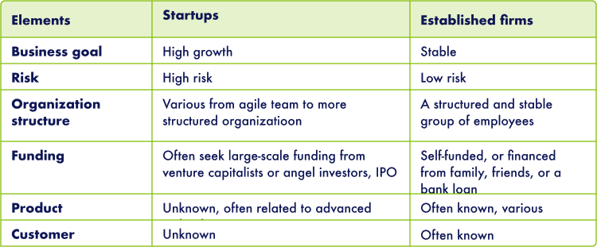

# Startup vagy KKV?

**Ki melyik? Mitől más a startup, mint a KKV? Perceken belül kiderül.**

## Startup vagy KKV?

Fontos már az elején tisztázni, hogy bár a startup egy korai fázisú cég általában néhány alapítóval és kevés tőkével, de céljait, finanszírozási formáit, növekedési potenciálját, termékfejlesztési vagy az üzleti modelljeit tekintve merőben különbözik a hagyományos kis és középvállalkozásoktól.

Ahogy a táblázatban is látszik, néhány alapvető különbség van a kettő között. Egy startup üzleti célja a korai stabilitás és profittal szemben az exponenciális növekedés. A termék és a megfogalmazott célpiacok bár már az első üzleti tervben szerepelnek, legtöbbször folyamatos módosításokon mennek keresztül mire elérik a végleges formájukat. Ez egy korai fázisú startupnál nagy jelentőséggel bír, és a csapat kitartását és nyitottságát is kockára teszi ami döntő jelentőséggel bír a növekedés szempontjából. Ennek az iterációs folyamatnak az eredménye, hogy az eredeti ötletre építve megszületik egy MVP, ami már bemutatható a célpiacnak, és ami még fontosabb, a felhasználóktól szerzett tapasztalatokra építve lehet a terméket/üzleti modellt tovább fejleszteni. A startupok finanszírozási formái is merőben különböznek a KKV-tól. A bár magas kockázattal, de hasonlóan magas növekedési potenciállal rendelkező startupok érettségi szinttől függően - FFF’s, akcelerátorok, angyal befektetők, kockázati tőkebefektetők, nagyvállalati befektetők, IPO - próbálnak befektetőtől tőkét bevonni jellemzően üzletrészért cserébe és egy későbbi exit lehetőségével. Az itt felmerülő kifejezésekkel, folyamatokkal a további fejezetekben részletesen foglalkozunk.

## Kapcsolódó interaktív tartalmak

[Gross Margins, Early to late - Podcast](https://open.spotify.com/episode/79lJCrHB3nBn1qXCxKA5s7?go=1&sp_cid=51b7f52f873ff15d01aa226747f498be&utm_source=embed_player_p&utm_medium=desktop)
[The art of blitzscaling](https://hbr.org/2016/04/blitzscaling)

## Következő
[Következő](StartupAsCulture.md)